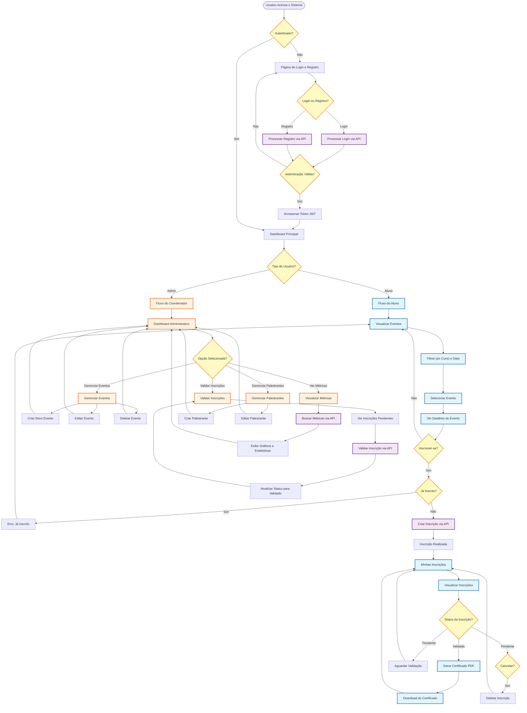

# 🎓 UniAlfa Eventos

> Plataforma interativa para organizar e promover eventos acadêmicos da Faculdade UniALFA

[](https://nodejs.org/)
[](https://www.php.net/)
[](https://www.java.com/)
[](https://www.mysql.com/)

## 📋 Índice

- [Sobre o Projeto](#-sobre-o-projeto)
- [Funcionalidades](#-funcionalidades)
- [Fluxo do Sistema](#-fluxo-do-sistema)
- [Tecnologias](#-tecnologias)
- [Estrutura do Projeto](#-estrutura-do-projeto)
- [Pré-requisitos](#-pré-requisitos)
- [Instalação](#-instalação)
- [Configuração](#-configuração)
- [Execução](#-execução)
- [Autores](#-autores)

## 🧠 Sobre o Projeto

O **UniAlfa Eventos** é uma plataforma desenvolvida durante um **hackathon institucional** que centraliza todos os eventos acadêmicos da Faculdade UniALFA. A solução foi projetada para ser **simples**, **intuitiva** e **eficiente**, eliminando a necessidade de formulários dispersos e proporcionando uma experiência focada nos eventos.

### Objetivo Principal

Criar um ambiente único onde coordenadores possam gerenciar eventos e alunos possam visualizar, se inscrever e gerar certificados de forma descomplicada.

## ✨ Funcionalidades

### Para Coordenadores
- ✅ Cadastro e gerenciamento de eventos
- ✅ Controle de palestrantes e suas informações
- ✅ Visualização de métricas e inscrições
- ✅ Geração de certificados para participantes
- ✅ Filtros por curso e organização de eventos

### Para Alunos
- ✅ Visualização de todos os eventos disponíveis
- ✅ Inscrição em eventos de interesse
- ✅ Acompanhamento de inscrições realizadas
- ✅ Geração automática de certificados
- ✅ Informações detalhadas sobre palestrantes

### Recursos Técnicos
- 🔒 Sistema de autenticação e autorização
- 📊 Dashboard com métricas em tempo real
- 🎨 Interface moderna com Tailwind CSS
- 📱 Design responsivo
- 🔍 Sistema de filtros avançados
- ⚠️ Validação de conflitos de horários

## 🔄 Fluxo do Sistema

O diagrama abaixo ilustra o fluxo principal do sistema, mostrando as interações entre usuários (alunos e coordenadores) e os principais processos:



### Descrição dos Fluxos Principais

#### 🔵 Fluxo do Aluno (Azul)
1. **Autenticação**: Login ou registro no sistema
2. **Visualização**: Navegação pelos eventos disponíveis com filtros
3. **Inscrição**: Seleção e inscrição em eventos de interesse
4. **Gerenciamento**: Acompanhamento das próprias inscrições
5. **Certificação**: Geração de certificados para eventos validados

#### 🟠 Fluxo do Coordenador/Admin (Laranja)
1. **Dashboard**: Acesso ao painel administrativo
2. **Gerenciamento de Eventos**: Criação, edição e exclusão de eventos
3. **Validação**: Aprovação de inscrições dos alunos
4. **Métricas**: Visualização de estatísticas e relatórios
5. **Palestrantes**: Gerenciamento de informações dos palestrantes

#### 🟣 Processos de API (Roxo)
Todas as operações críticas são processadas através da API Node.js, garantindo segurança e consistência dos dados.

## 🚀 Tecnologias

### Backend
- **Node.js** + **Express** + **TypeScript** - API RESTful
- **Knex.js** - Query Builder e Migrations
- **MySQL** - Banco de dados relacional
- **JWT** - Autenticação via tokens
- **Zod** - Validação de schemas

### Frontend
- **PHP** - Aplicação web server-side
- **Tailwind CSS** - Framework CSS utilitário
- **JavaScript** - Interatividade

### Desktop
- **Java 21** - Aplicação desktop com Swing
- **Maven** - Gerenciamento de dependências
- **MySQL Connector** - Conexão com banco de dados

### Ferramentas
- **FPDF** - Geração de PDFs (certificados)
- **bcrypt** - Hash de senhas

## 📁 Estrutura do Projeto

```
Hackatoon/
│
├── Node/                    # Backend API (Node.js + TypeScript)
│   ├── src/
│   │   ├── controller/      # Controladores da API
│   │   ├── database/        # Configuração e migrations
│   │   ├── middeware/       # Middlewares (auth, error handling)
│   │   ├── routes/          # Definição de rotas
│   │   ├── utils/           # Utilitários
│   │   └── server.ts        # Servidor Express
│   ├── Knexfile.ts          # Configuração do Knex
│   └── package.json
│
├── Php/                     # Frontend Web (PHP)
│   ├── class/               # Classes auxiliares
│   ├── controller/          # Controladores PHP
│   ├── view/                # Views e templates
│   │   ├── partials/        # Componentes reutilizáveis
│   │   └── template/        # Templates base
│   ├── imagens/             # Assets de imagens
│   ├── index.php            # Ponto de entrada
│   └── route.php            # Roteamento
│
├── Java/                    # Aplicação Desktop
│   ├── src/main/java/
│   │   └── hackatton/
│   │       ├── dao/         # Data Access Object
│   │       ├── gui/          # Interface gráfica
│   │       ├── model/        # Modelos de dados
│   │       ├── service/      # Lógica de negócio
│   │       └── Main.java     # Classe principal
│   └── pom.xml              # Configuração Maven
│
└── sqlProjeto.sql           # Script SQL do banco de dados
```

## 📋 Pré-requisitos

Antes de começar, certifique-se de ter instalado:

- **Node.js** (versão 18 ou superior) e **npm**
- **MySQL** (versão 8.0 ou superior)
- **PHP** (versão 7.4 ou superior) com servidor embutido
- **Java JDK 21** (para o módulo Java)
- **Maven** (para gerenciar dependências Java)
- **Git** (para clonar o repositório)

## 🔧 Instalação

### 1. Clone o repositório

```bash
git clone https://github.com/VilleNunes/Hackatoon.git
cd Hackatoon
```

### 2. Configure o Banco de Dados

Crie um banco de dados MySQL chamado `unialfa`:

```sql
CREATE DATABASE unialfa CHARACTER SET utf8mb4 COLLATE utf8mb4_general_ci;
```

Execute o script SQL para criar as tabelas:

```bash
mysql -u root -p unialfa < sqlProjeto.sql
```

Ou execute manualmente o conteúdo do arquivo `sqlProjeto.sql` no seu cliente MySQL.

### 3. Configure o Backend (Node.js)

```bash
# Entre na pasta do Node
cd Node

# Instale as dependências
npm install

# Configure a conexão com o banco de dados
# Edite o arquivo Knexfile.ts com suas credenciais do MySQL
```

**Importante:** Ajuste as credenciais do banco de dados no arquivo `Node/Knexfile.ts`:

```typescript
connection: {
  host: "localhost",
  user: "root",        // Seu usuário MySQL
  password: "",        // Sua senha MySQL
  database: "unialfa",
  port: 3306,
}
```

### 4. Execute as Migrations

```bash
# Ainda na pasta Node
npx knex migrate:latest
```

### 5. Configure o Frontend (PHP)

```bash
# Volte para a raiz e entre na pasta PHP
cd ../Php

# Instale as dependências do Composer (se necessário)
composer install
```

**Nota:** Se você não tiver o Composer instalado, pode pular esta etapa, pois as dependências já estão no diretório `vendor/`.

### 6. Configure a Aplicação Java (Opcional)

```bash
# Entre na pasta Java
cd ../Java

# Compile o projeto (Maven fará o download das dependências automaticamente)
mvn clean install
```

## ⚙️ Configuração

### Variáveis de Ambiente

Atualmente, as configurações estão hardcoded nos arquivos. Para produção, recomenda-se usar variáveis de ambiente:

**Node.js** (`Knexfile.ts`):
- Host do banco de dados
- Usuário e senha do MySQL
- Nome do banco de dados

**Java** (`Dao.java`):
- URL de conexão JDBC
- Credenciais do banco de dados

**PHP**:
- Verifique os arquivos de controller para configurações de API

## 🚀 Execução

### Iniciar o Backend (Node.js)

```bash
cd Node
npm run dev
```

O servidor estará rodando em `http://localhost:3333`

### Iniciar o Frontend (PHP)

Em um novo terminal:

```bash
cd Php
php -S localhost:8080
```

A aplicação web estará disponível em `http://localhost:8080`

### Executar a Aplicação Java (Desktop)

```bash
cd Java
mvn exec:java -Dexec.mainClass="hackatton.Main"
```

Ou compile e execute manualmente:

```bash
mvn compile
java -cp target/classes hackatton.Main
```

## 📊 Banco de Dados

O banco de dados possui as seguintes tabelas principais:

- **`evento`** - Armazena informações dos eventos
- **`palestrante`** - Dados dos palestrantes
- **`curso`** - Cursos disponíveis
- **`inscricao`** - Inscrições dos alunos em eventos
- **`users`** - Usuários do sistema

## 🔐 Autenticação

O sistema utiliza JWT (JSON Web Tokens) para autenticação. Os tokens são gerados no login e devem ser enviados nas requisições protegidas.

## 📝 Notas Importantes

- Certifique-se de que o MySQL está rodando antes de iniciar os serviços
- O backend Node.js deve estar rodando antes de usar o frontend PHP
- As portas padrão são:
  - Backend API: `3333`
  - Frontend PHP: `8080`
- Para produção, configure variáveis de ambiente e use um servidor web adequado (Apache/Nginx) para o PHP

## 👥 Autores

Este projeto foi desenvolvido durante um hackathon institucional pela equipe:

- **Bruno Cernach Madeira**
- **Gabriel de Abreu da Silva**
- **Heitor dos Santos Corrêa**
- **Ville Nunes Figueiredo da Silva**

